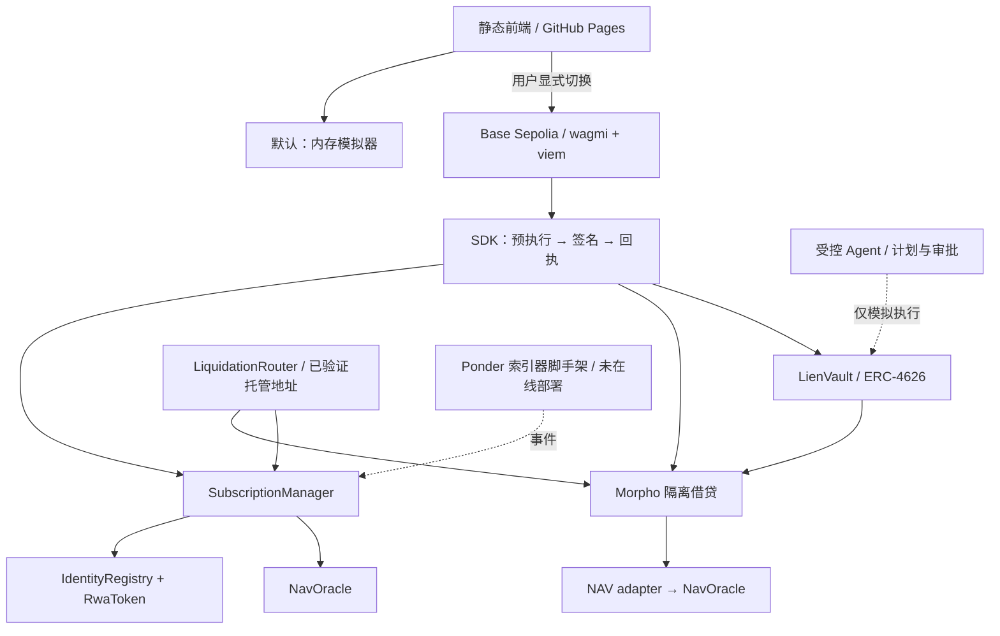

# 架构与信任边界

lien 是使用模拟资产的 RWA 信贷技术实践，不是已落地的真实资产发行、持牌理财产品或完整 ERC-3643 合规实现。

| 层 | 自行实现 / 集成 | 不应夸大的边界 |
|---|---|---|
| 受限资产 | 白名单、冻结、强制转移、账户恢复；复用 OZ | 地址白名单不等于真实 KYC/AML，更不证明合法发行 |
| 申购 / 赎回 | USDC 6 位 ↔ RWA 18 位，NAV 定价，T+N 队列、保护已申请储备 | mock USDC 无实际美元背书；链上储备不能证明链下托管 |
| NAV | 时间有效性、暂停、偏离阈值，Chainlink source 适配代码 | 管理员可强制改 NAV；适配器代码存在不代表真实 RWA 数据接入 |
| 借贷 | **复用 vendored Morpho Blue**，自建 NAV adapter / 清算 router | 不是自行发明借贷引擎；NAV 拒绝会阻止依赖价格的借款/退出/清算，但不冻结所有方法 |
| 清算 | 合规托管 router 持有 RWA，USDC buffer 支付激励 | 依赖 buffer、赎回流动性与白名单；不是无条件可执行清算 |
| 金库 | **复用 OZ ERC-4626**，自建 cap / 队列分配层 | 缺 timelock、费用与生产级治理，cap 不是损失上限；只有一个配置市场时不能称已分散风险 |
| 受控 Agent | 窄范围意图 → 结构化计划 → 模型外策略 → 精确审批 → 模拟执行；session/artifact 记录完整流程 | 当前 parser 是确定性替身，执行仅为 wallet-free simulation；审批指纹不是钱包签名，也不代表法律合规 |
| 索引器 | Ponder 事件处理与 schema 脚手架 | Pages 不提供服务端；当前界面读 RPC，而不是已上线数据平台 |

## 角色与资金

- **资产 agent / admin**：身份与资产干预权限是强信任假设，不能包装为无信任。此处 agent 是合约角色，不是 LLM Agent。
- **NAV updater / admin**：能够改变定价。过期/暂停拒绝依赖有效价格的操作，但到期赎回使用既有锁定金额，偿还债务不需要新价格。
- **金库 curator**：可以即时改变 cap 与队列；不得把它理解成收益保证。USDC 金库不持有 RWA，因此本实现不检查其存款人白名单——这不构成法律判断。
- **普通用户**：签名前预执行；只对当前动作授权必要数额。交易广播后确认未知不能等同失败重发。

## 生产化之前

需要外部法律/托管/资产证明、真实身份服务、独立安全审计、治理延迟、预言机运维、异常与重组处理、监控、索引服务和压力测试。当前演示与回归不证明偿付能力、协议安全或投资收益。
